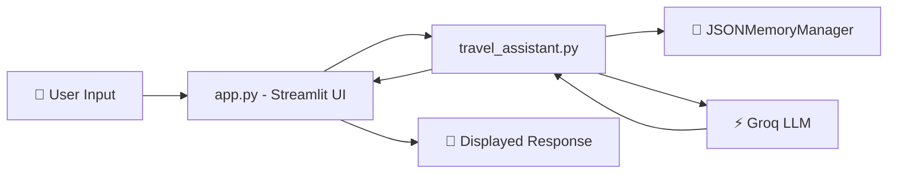

# ✈️ Travel Assistant

A conversational AI-powered travel assistant built with **Streamlit**, **LangChain**, and **Groq (Llama 3.3 70B)**. Chat naturally about destinations, itineraries, packing tips, and local culture — with full conversation memory persisted to disk.


---

## 🌟 Features

- 💬 **Interactive Chat UI** — Clean, streaming chat interface powered by Streamlit
- 🧠 **Persistent Memory** — Conversations are saved to a local JSON file so context carries across sessions
- 🚀 **Fast LLM Inference** — Uses Groq's `llama-3.3-70b-versatile` model via LangChain
- 🗺️ **Travel-Focused Persona** — Tuned system prompt for itineraries, packing tips, cultural insights, and trip logistics
- ⌨️ **Typing Effect** — Simulated word-by-word response streaming for a natural chat feel

---

## 🏗️ Project Structure

```
📦 travel-assistant
├── 📄 app.py                  # Streamlit frontend & chat loop
├── 📄 travel_assistant.py     # Core assistant logic (LLM + prompt orchestration)
├── 📄 memory_management.py    # JSON-based conversation memory manager
├── 📄 conversation_memory.json # Auto-generated conversation store
├── 📄 .env                    # Environment variables (not committed)
└── 📄 README.md
```

---

## ⚙️ How It Works

1. **`app.py`** renders the Streamlit chat UI, manages session state, and streams responses to the user.
2. **`travel_assistant.py`** builds a LangChain prompt (system persona + chat history + user input), invokes the Groq LLM, and stores the exchange back into memory.
3. **`memory_management.py`** reads/writes conversation history to `conversation_memory.json`, keyed by a `conversation_id`.



---

## 🛠️ Prerequisites

- 🐍 Python 3.9+
- 🔑 A [Groq API key](https://console.groq.com/)

---

## 📦 Installation

1. **Clone the repository**
   ```bash
   git clone https://github.com/your-username/travel-assistant.git
   cd travel-assistant
   ```

2. **Create a virtual environment** (recommended)
   ```bash
   python -m venv venv
   source venv/bin/activate   # On Windows: venv\Scripts\activate
   ```

3. **Install dependencies**
   ```bash
   pip install streamlit langchain langchain-groq python-dotenv
   ```

4. **Set up your environment variables**

   Create a `.env` file in the project root:
   ```env
   GROQ_API_KEY=your_groq_api_key_here
   ```

---

## ▶️ Usage

Run the Streamlit app:

```bash
streamlit run app.py
```

Then open your browser at **http://localhost:8501** and start chatting! 🎉

---

## 💡 Example Prompts

- 🗺️ "Plan me a 5-day itinerary for Kyoto, Japan"
- 🎒 "What should I pack for a winter trip to Iceland?"
- 🍜 "Tell me about local dining etiquette in Vietnam"
- 🧳 "I have a $1500 budget for a weekend trip in Europe — where should I go?"

---

## 🧩 Key Components

| Component | Responsibility |
|-----------|----------------|
| `TravelAssistant` | Orchestrates the LLM chain, formats chat history, and manages the travel persona |
| `JSONMemoryManager` | Persists and retrieves conversation history per `conversation_id` |
| `app.py` | Streamlit UI, session state, and simulated response streaming |

---

## 🔒 Notes & Considerations

- 📁 Conversation history is stored **locally in plaintext JSON** — not suitable for production/multi-user deployments as-is.
- 👤 The app currently uses a single hardcoded `conversation_id` (`"default_user"`); extend this for multi-user support.
- 🔐 Never commit your `.env` file or API keys to version control.

---

## 🚧 Roadmap Ideas

- [ ] 👥 Multi-user session support with unique conversation IDs
- [ ] 🗄️ Swap JSON storage for a database (SQLite/PostgreSQL)
- [ ] 🌐 Add real-time flight/hotel data integrations
- [ ] 🎨 Enhance UI with trip cards, maps, and images
- [ ] 🧪 Add unit tests for memory management and assistant logic

---

## 📄 License

This project is open source and available under the [MIT License](LICENSE).

---

## 🙌 Acknowledgements

- [LangChain](https://www.langchain.com/) for LLM orchestration
- [Groq](https://groq.com/) for blazing-fast inference
- [Streamlit](https://streamlit.io/) for the effortless UI

---

<p align="center">Made with ❤️ for travelers and tinkerers alike</p>
